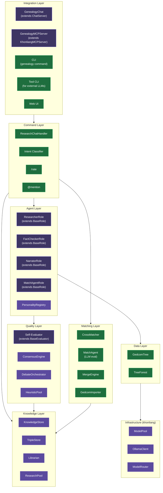
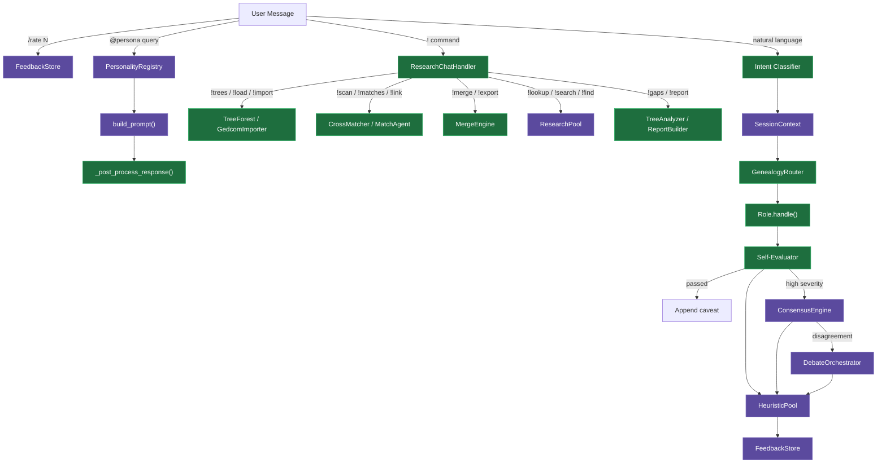
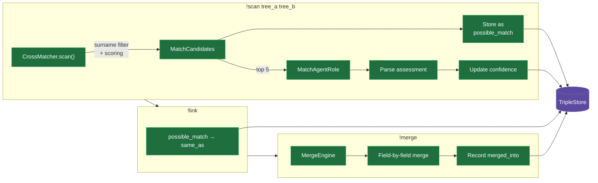

# Architecture

## System Overview

The genealogy agent is a multi-layer application built on [ollama-khonliang](https://github.com/tolldog/ollama-khonliang). It manages family tree data (GEDCOM files), routes user queries to specialist LLM roles, validates responses against tree data, and orchestrates cross-tree matching via consensus voting.

> Components from khonliang are shown in **purple**. Genealogy-specific components are in **green**. Components that **extend** a khonliang base class are shown in **indigo** (mixed).

## Layer Diagram



## Module Map

### Data Layer

| Module | Purpose |
|--------|---------|
| `gedcom_parser.py` | GEDCOM 5.5/5.5.1 parser. `Person` and `Family` dataclasses. `GedcomTree` with search, relationship traversal, ancestor/descendant chains, context building. |
| `forest.py` | `TreeForest` manages multiple named `GedcomTree` instances. `QualifiedPerson` wraps persons with tree provenance. Qualified xrefs (`tree_name:@I1@`) prevent collisions. `load_forest_from_config()` handles backward compat. |

### Agent Layer

| Module | Purpose |
|--------|---------|
| `roles.py` | `ResearcherRole`, `FactCheckerRole`, `NarratorRole` — extend `BaseRole`. Smart context building with session injection and heuristic rule injection via `_effective_system_prompt()`. |
| `match_agent.py` | `MatchAgentRole` — dedicated LLM role for cross-tree person comparison. Produces `MatchAssessment` (verdict/confidence/evidence/conflicts). `MatchVotingAgent` wraps for consensus. |
| `router.py` | `GenealogyRouter` — extends `BaseRouter` with keyword dispatch to fact_checker, narrator, or researcher (fallback). |
| `personalities.py` | 4 genealogy personas (genealogist, historian, detective, skeptic) registered with khonliang's `PersonalityRegistry`. |
| `intent.py` | LLM-based intent classifier with compound intent support. |

### Matching Layer

| Module | Purpose |
|--------|---------|
| `cross_matcher.py` | `CrossMatcher` — heuristic person matching across trees. Weighted scoring: name (40%), date (25%), place (20%), family structure (15%). Surname pre-filtering for performance. |
| `importer.py` | `GedcomImporter` — import with `TreeAnalyzer` sanity checks (date anomalies block, missing data warns). GEDCOM 5.5.1 export with roundtrip fidelity. |
| `merge.py` | `MergeEngine` — merge matched persons with strategies (prefer_target, prefer_source, merge_all). Records provenance as `merged_into` triples. |

### Quality Layer

| Module | Purpose |
|--------|---------|
| `self_eval.py` | `DateCheckRule`, `RelationshipCheckRule` verify LLM claims against tree data. `SpeculationRule`, `UncertaintyRule` detect hedging. Factory: `create_genealogy_evaluator()`. |
| `consensus.py` | `GenealogyVotingAgent` wraps roles for `AgentTeam`. `create_consensus_team()` for response quality. `create_match_consensus_team()` for match disputes (MatchAgent 55%, FactChecker 45%). |

### Integration Layer

| Module | Purpose |
|--------|---------|
| `server.py` | `GenealogyChat` extends `ChatServer`. `build_server()` wires all components. Message flow: /rate -> @mention -> !commands -> intent -> routing -> eval -> consensus -> feedback. |
| `chat_handler.py` | `ResearchChatHandler` dispatches 25+ `!` commands: research, analysis, knowledge, matching, import/export. |
| `mcp_server.py` | `GenealogyMCPServer` — tree tools, forest tools, matching tools, training tools. Stdio + HTTP transports. |
| `web_server.py` | HTTP server for web UI with theme injection. |
| `web/index.html` | Chat interface with tree selector dropdown, import/export buttons. |
| `cli.py` | User-facing CLI (`genealogy` command via pyproject.toml entry point). Single-tree and multi-tree commands. |
| `tool.py` | Programmatic CLI for external LLMs — structured output for piping into other tools. |

## Request Flow



## Cross-Tree Matching Flow



## Storage

All SQLite stores share `data/knowledge.db`:

| Store | Purpose | Key Tables |
|-------|---------|------------|
| `KnowledgeStore` | Three-tier knowledge (axiom/imported/derived) | `knowledge_entries`, `knowledge_fts` |
| `TripleStore` | Semantic facts + cross-tree links | `triples`, `triples_fts` |
| `FeedbackStore` | Interaction logging + user ratings | `agent_interactions`, `training_feedback` |
| `HeuristicPool` | Evaluation outcomes + learned rules | `outcomes`, `heuristics` |

### TripleStore Link Conventions

| Predicate | Usage | Source |
|-----------|-------|--------|
| `same_as` | Confirmed identity match | `user_confirmed`, `match_agent`, `mcp_confirmed` |
| `possible_match` | Candidate awaiting confirmation | `cross_matcher`, `match_agent` |
| `not_same_as` | Explicitly rejected match | `user_rejected` |
| `merged_into` | Post-merge provenance record | `merge_engine` |

## Configuration

All features are config-driven via `config.yaml` with env var overrides:

```yaml
app:
  gedcom: "data/family.ged"         # Single tree (backward compat)
  gedcoms:                           # Multi-tree: name -> path
    toll: "data/toll.ged"
    smith: "data/smith.ged"

ollama:
  models:
    researcher: "llama3.2:3b"       # Fast, stays hot (30m keep_alive)
    fact_checker: "qwen2.5:7b"      # Medium, 5m keep_alive
    narrator: "llama3.1:8b"         # Larger, 5m keep_alive
    match_agent: "qwen2.5:7b"       # Shares model with fact_checker

matching:
  min_heuristic_score: 0.6          # Minimum CrossMatcher score for candidates
  min_agent_confidence: 0.75        # Minimum MatchAgent confidence for auto-link
  max_scan_results: 50

consensus:
  enabled: true
  timeout: 30                        # Seconds per voting agent
  debate_enabled: true
  debate_rounds: 2
  disagreement_threshold: 0.6

training:
  feedback_enabled: true             # Log interactions to FeedbackStore
  heuristics_enabled: true           # Record outcomes, learn rules
```

Environment overrides: `OLLAMA_URL`, `GEDCOM_FILE`, `GEDCOM_FILES` (comma-separated `name=path` pairs), `WS_PORT`, `WEB_PORT`, `APP_TITLE`.

## Public API

From `genealogy_agent/__init__.py`:

**Core**: `GedcomTree`, `Person`, `Family`, `load_config`

**Multi-tree**: `TreeForest`, `QualifiedPerson`, `load_forest_from_config`

**Roles & routing**: `GenealogyRouter`, `ResearcherRole`, `FactCheckerRole`, `NarratorRole`

**Matching**: `CrossMatcher`, `MatchCandidate`, `MatchAgentRole`, `MatchVotingAgent`, `MatchAssessment`

**Import/merge**: `GedcomImporter`, `ImportResult`, `MergeEngine`, `MergeResult`

**Consensus**: `GenealogyVotingAgent`, `create_consensus_team`, `create_debate_orchestrator`, `create_match_consensus_team`

**Evaluation**: `create_genealogy_evaluator`

**Personalities**: `create_genealogy_registry`
